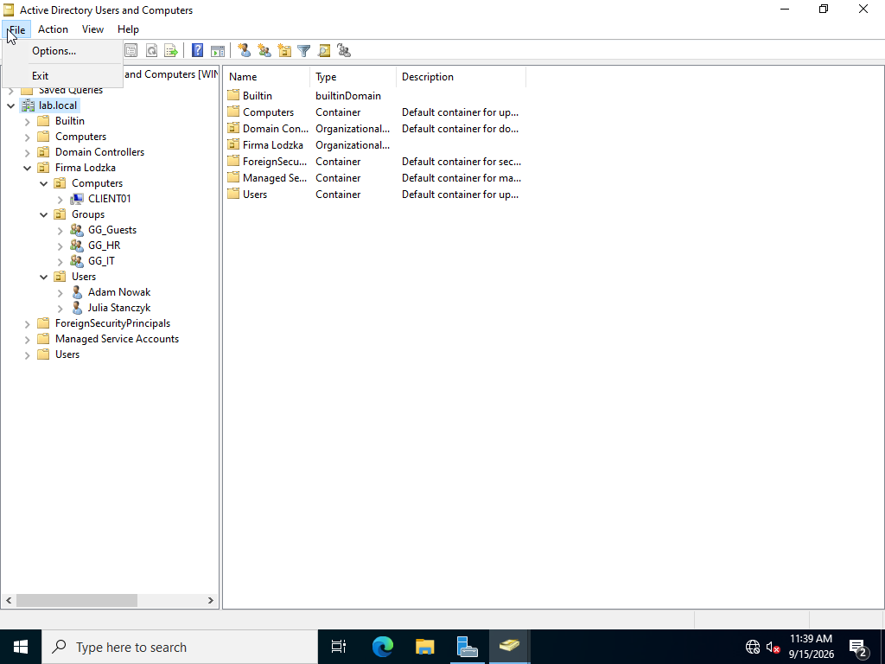
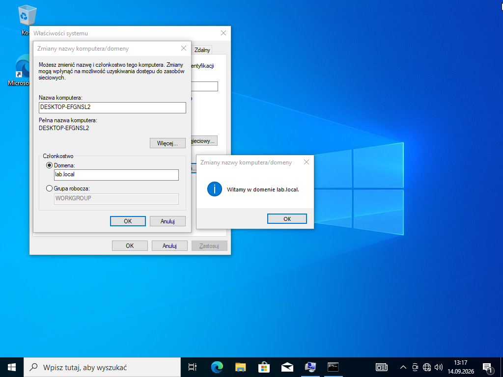
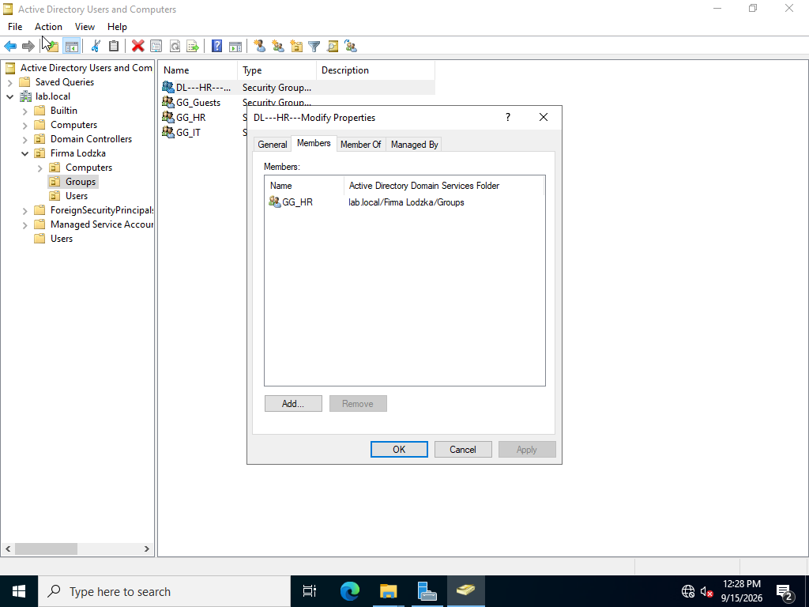

# Windows Server & Active Directory Home Lab

## Overview

This project documents a Windows Server 2022 home lab built in VirtualBox to practice practical Windows infrastructure administration.

The environment contains a Windows Server Domain Controller and a Windows 10 domain client. I configured and tested Active Directory Domain Services, DNS, DHCP, Group Policy, SMB file-share permissions, and RRAS/NAT routing.

The goal of the lab was not only to configure services, but also to **validate them from the client side and troubleshoot configuration problems**.

## Lab Architecture

```text
                         Internet
                            |
                     VirtualBox NAT
                            |
                 Windows Server 2022
                 Domain: lab.local
          AD DS / DNS / DHCP / RRAS-NAT
                       10.0.0.1
                            |
                  Internal Virtual LAN
                     10.0.0.0/24
                            |
                    Windows 10 Client
                        CLIENT01
                    DHCP: 10.0.0.50
```

### Technologies

- Windows Server 2022
- Windows 10
- VirtualBox
- Active Directory Domain Services (AD DS)
- DNS
- DHCP
- Group Policy
- SMB file sharing
- Windows security groups and permissions
- Routing and Remote Access (RRAS)
- Network Address Translation (NAT)

---

## Active Directory

I created the `lab.local` domain and organized users, groups and computers into a custom Organizational Unit structure.

The lab includes:

- domain users,
- Global security groups,
- Domain Local security groups,
- a dedicated computer OU,
- a Windows 10 client joined to the domain.



### Domain Join

`CLIENT01` was configured to use the Domain Controller as its DNS server and successfully joined to `lab.local`.



### Group-based access model

For file permissions, I used separate user groups and permission groups. For example, the `GG_HR` Global group is a member of the `DL_HR_Modify` Domain Local group, which is then used to assign access to the HR share.



---

## Group Policy

I created a Group Policy Object that prevents users in the selected OU from accessing Control Panel and PC settings.


The policy was refreshed on the client using `gpupdate /force` and verified with `gpresult /r`.


The result was then tested directly on the Windows 10 client.


This demonstrated the full workflow:

```text
Create GPO
   ↓
Link it to an OU
   ↓
Refresh policy on client
   ↓
Verify with gpresult
   ↓
Test the configured restriction
```

---

## File Share and Permissions

I created an HR network share and assigned access through Active Directory security groups instead of directly assigning permissions to individual users.

The `DL_HR_Modify` group was granted Change and Read share permissions.


### Access validation

A user belonging to the authorized group was able to access the share and create a file:


A user outside the authorized group was denied access:


This allowed me to practice group-based access control and verify permissions from the end-user side.

---

## DHCP

The Windows Server DHCP role provides automatic network configuration to domain clients.

### Configuration

| Setting | Value |
|---|---|
| Network | `10.0.0.0/24` |
| Domain Controller / DHCP Server | `10.0.0.1` |
| DHCP pool | `10.0.0.50 - 10.0.0.200` |
| Default gateway | `10.0.0.1` |
| DNS server | `10.0.0.1` |
| DNS domain | `lab.local` |

### Address Pool


### Scope Options

DHCP distributes the Domain Controller as the client's default gateway and DNS server.


### Client Configuration and Lease Verification

`CLIENT01` received its configuration dynamically from the DHCP server.


The lease was also verified from the server side.


---

## DNS

The Domain Controller also provides DNS for the `lab.local` domain.

Domain clients use `10.0.0.1` as their DNS server. This allows them to locate domain services and resolve internal hostnames. External name resolution was also tested from the client.


A future cleanup task is to add reverse lookup records and further refine DNS registration for the server's secondary RRAS interface.

---

## RRAS / NAT

The Windows Server has separate internal and external network connectivity. Routing and Remote Access was configured with NAT so that the isolated domain client can access the Internet through the server.


External connectivity was verified from `CLIENT01`.


---

## Troubleshooting

Troubleshooting was a significant part of the lab rather than only following a successful configuration path.

Examples included:

- diagnosing one-way connectivity between the server and client,
- checking Windows Firewall and IP configuration,
- correcting DHCP gateway and DNS options,
- troubleshooting an incorrect RRAS/NAT configuration,
- recreating the RRAS configuration after unstable external connectivity,
- validating DHCP leases from both the client and server side,
- investigating DNS registration after adding a second network interface.

The general troubleshooting workflow used in the lab was:

```text
Identify the symptom
        ↓
Check IP / DNS / gateway configuration
        ↓
Test connectivity or name resolution
        ↓
Verify the relevant server-side service
        ↓
Apply a fix
        ↓
Retest and confirm
```

---

## Skills Demonstrated

This project gave me hands-on practice with:

- deploying and administering a Windows Server domain,
- Active Directory users, groups, OUs and domain computers,
- joining Windows clients to a domain,
- using security groups to manage access,
- configuring and validating Group Policy,
- using `gpupdate` and `gpresult`,
- configuring SMB share permissions,
- testing authorized and unauthorized access,
- configuring DHCP scopes and options,
- understanding the relationship between AD DS and DNS,
- configuring RRAS and NAT,
- Windows network troubleshooting,
- validating configurations from both the server and client side.

---

## Next Steps

Planned improvements:

- reverse DNS / PTR records,
- cleanup of DNS registration for the secondary server interface,
- additional NTFS permission scenarios,
- PowerShell-based Active Directory administration,
- additional troubleshooting scenarios and documentation.
